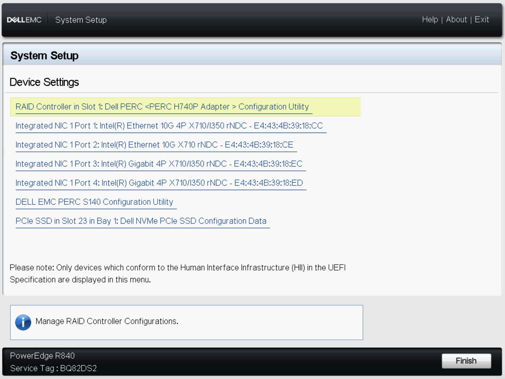
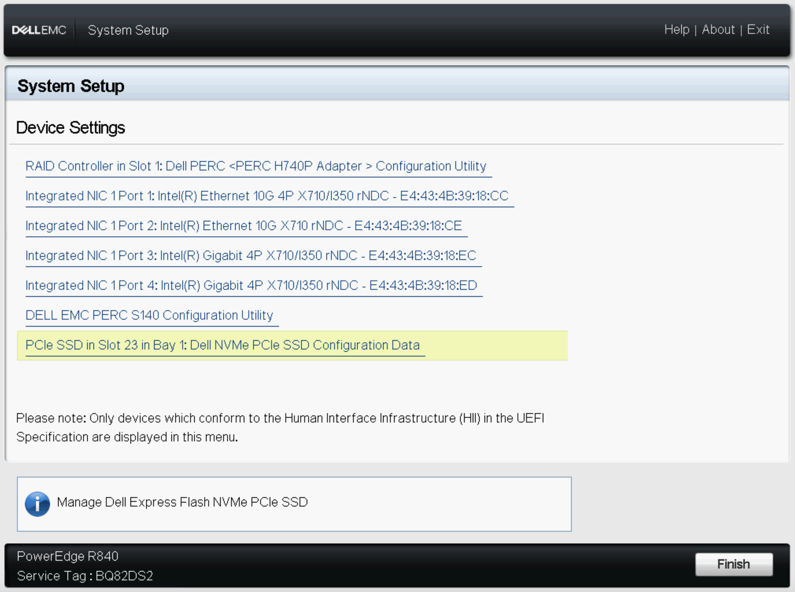

### Configure iDRAC

Once power has been connected to the servers setup they should automatically boot the lifecycle controllers. If not, hit `F10`.

### OS installation

1. During initial setup you will be present with the lifecycle controller.

2. Navigate to -> System Setup -> Advanced Hardware Configuration

3. Navigate to -> Device Settings -> RAID Controller - PERC

4. Configure the SSD RAID as Follow for each Server

  - Sensor Tier
    - RAID 0 240 GB SSD x 1 (NAME: OS)
    - RAID 0 1.6TB SSD x 5 (NAME: FAST)

  - Data Tier (ESXI)
    - RAID 0 240 GB SSD X 1 (NAME: OS_ISO)
    - RAID 0 1.6TB SSD x 3 (NAME: FAST)

5. Navigate to -> Device Settings -> RAID Controller - NVME
  - Sensor Tier
    - RAID 0 1.6 NVME

  - Data Tier (ESXI)
    - RAID 0 1.6 NVME

6. When Configuration is finished exit Lifecycle Controller and Install OS via the iDRAC or Installation Media

Proceed to [Rock OS Deployment](rocknsm/README.md)
