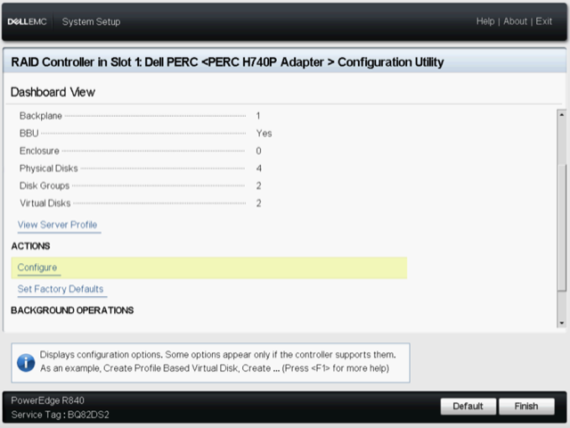

# Dell R840 Configuration (Data and Sensor)

## Prereq
- Monitor
- Keyboard
- Mouse

### Configure iDRAC

Once power has been connected to the servers setup they should automatically boot the lifecycle controllers. If not, hit `F10`.

1. Navigate to -> `System Setup`

1. Click `Advanced Hardware Configuration`

  

1. Select `IDRAC settings`
  

1. Select `Network`
  

1. Set the following values:
  - IPV4: Enabled
  - DHCP : Disabled
  - IP, Gateway, & DNS: Consult [platform-management](../platform-management.md)
  - Subnet: 255.255.255.0
  - IPV6: Disable

1. Click `Back`
1. Click `Finish`
1. Click `Finish`, Again.
1. Click `Yes` to save the IDRAC configuration, and `ok`
1. This should return you to the System Setup page

### Raid Configuration for Installation

#### Data Tier SSD (ESXI (Server 2))
1. Navigate to -> `System Setup`

1. Click `Advanced Hardware Configuration`
> if you are already in the system setup page then you can skip this step

  

1. Navigate to -> `Device Settings`

  

1. Select the RAID Controller that is labeled PERC

  

1. Select Configure

  

1. Select Create Virtual disk

  

  - Answer check `confirm` and `yes` to the question `Are you sure you want to clear this configuration?`

  - Select `Create Virtual Disk`

  - Select `RAID0`

  - Select `Unconfigured Capacity`

  - Select `Select Physical Drives`

    

    - Drive Configuration as follows:
      - Media Type: SSD
      - Interface Type: SATA
      - Sector Size: 512 B
      - Select **ONLY** the ~240 GB hardrive
    - Select `Apply Changes` and `Ok`
  - Enter Virtual Disk Name: OS
  - Select `Create Vitual Disk` at the bottom of the page. Check `Confirm` and `Yes` then `Ok`

1. Select Create Virtual disk

  

  - Answer check `confirm` and `yes` to the question `Are you sure you want to clear this configuration?`

  - Select `Create Virtual Disk`

  - Select `RAID0`

  - Select `Unconfigured Capacity`

  - Select `Select Physical Drives`

    

    - Drive Configuration as follows:
      - Media Type: SSD
      - Interface Type: SATA
      - Sector Size: 512 B
      - Select the remaining 3 Harddrives
    - Select `Apply Changes` and `Ok`
  - Enter Virtual Disk Name: FAST
  - Select `Create Vitual Disk` at the bottom of the page. Check `Confirm` and `Yes` then `Ok`

#### Sensor SSD (Server 1)
1. Navigate to -> `System Setup`

1. Click `Advanced Hardware Configuration`
> if you are already in the system setup page then you can skip this step

  

1. Navigate to -> `Device Settings`

  

1. Select the RAID Controller that is labeled PERC

  

1. Select Configure

  

1. Select Create Virtual disk

  

  - Answer check `confirm` and `yes` to the question `Are you sure you want to clear this configuration?`

  - Select `Create Virtual Disk`

  - Select `RAID0`

  - Select `Unconfigured Capacity`

  - Select `Select Physical Drives`
    

    - Drive Configuration as follows:
      - Media Type: SSD
      - Interface Type: SATA
      - Sector Size: 512 B
      - Select **ONLY** the ~240 GB hardrive
    - Select `Apply Changes` and `Ok`
  - Enter Virtual Disk Name: OS
  - Select `Create Vitual Disk` at the bottom of the page. Check `Confirm` and `Yes` then `Ok`

1. Select Create Virtual disk

  

  - Answer check `confirm` and `yes` to the question `Are you sure you want to clear this configuration?`

  - Select `Create Virtual Disk`

  - Select `RAID0`

  - Select `Unconfigured Capacity`

  - Select `Select Physical Drives`

    

    - Drive Configuration as follows:
      - Media Type: SSD
      - Interface Type: SATA
      - Sector Size: 512 B
      - Select the remaining 3 Harddrives
    - Select `Apply Changes` and `Ok`
  - Enter Virtual Disk Name: FAST
  - Select `Create Vitual Disk` at the bottom of the page. Check `Confirm` and `Yes` then `Ok`

1. If done correctly, you should be greeted with a screen saying that you cannot configure any more drives, Click `Back`

  

At this point you have finished. the NVME drives will be standalone and not in a RAID Configuration.

1. When Configuration is finished exit Lifecycle Controller and Install OS via the iDRAC or Installation Media

  

Proceed to [Software Deployment](../topics/software-deployment.md)
