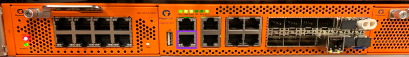
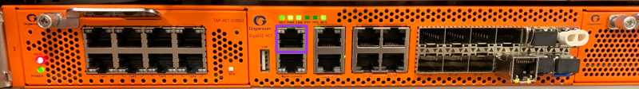

# Gigamon Configuration

Before you start, ensure that your Gigamon is [properly racked](../hardware-assembly.md)

# Initial Configuration (Console)
  
> Console port highlighted purple  

1. With a Mac or Linux system, connect a Console cable to the Console port of the Gigamon  
1. Connect your Console cable and go into your Terminal program (Terminal, iTerm, etc.)
```
ls /dev/*usb*
crw-rw-rw-  1 root  wheel   20, 115 Nov 29 15:06 /dev/cu.usbserial-A105LRRY (this could be slightly different on your system)
crw-rw-rw-  1 root  wheel   20, 114 Nov 29 15:06 /dev/tty.usbserial-A105LRRY (this could be slightly different on your system)
sudo cu -l /dev/cu.usbserial-A105LRRY -s 115200
```
> If you are using a different console access program, the following parameters are needed:
```
Baud Rate: 115,200
Data Bits: 8
Parity: None
Stop Bits: 1
Flow Control: None
```

1. This will ask you to log in with the [default credentials](../credentials.md)
1. As soon as you log in, you'll be asked to enter the `Initial Configuration`, let's do that.

  ```
  Gigamon GigaVUE-OS

  GigaVUE-OS configuration wizard

  Do you want to use the wizard for initial configuration? yes

  1. Hostname: tap.mo.cmat.lan
  2. Management Interface <eth0> : eth0
  3. Use DHCP on eth0 interface: no
  4. Use zeroconf on eth0 interface: no
  5. Primary IPv4 address and masklen: 10.1.10.5/24
  6. Default gateway: 10.1.10.1
  7. Primary DNS server: 10.1.10.1
  8. Domain name: cmat.lan
  9. Enable IPv6: no
  10. Enable secure cryptography: no
  11. Enable secure passwords: yes
  12. Minimum password length: 16
  13. Admin password (Enter to leave unchanged): (CHANGED)
  14. Cluster enable: no
  15. Box-id for the chassis: 2

  To change an answer, enter the step number to return to.
  Otherwise hit <enter> to save changes and exit.
  ```
1. Hit enter to save your configuration
1. You'll be presented with a summary of your configuration changes. You can go back and make any adjustments as necessary.  
 - If you decided not to change your default passphrase, you can do so in the webUI
 - If you decided to change your default passphrase, I **strongly** recommend you hop over to the webUI and make sure you can log in
> In the event that your passphrase isn't working, you should reset here before you logout of the console
```
tap.mo.cmat.lan > enable
tap.mo.cmat.lan # configure terminal
tap.mo.cmat.lan (config) # username admin|monitor|operator password
```

# Initial Configuration (WebUI)
1. Connect a network cable to the management port on the front of the Gigamon

> Management port highlighted purple  
1. Set your local IP address to be in the same subnet as the management IP you configured above (`10.1.10.6/24` as an example).
1. Point your browser to the management IP you set above (`https://10.1.10.5` in this example)
