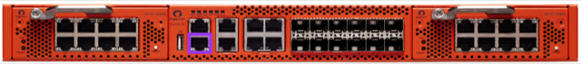

# Gigamon Configuration

# Initial Installation Steps
1. Ensure that your Gigamon is [properly racked](../hardware-assembly.md)

# Initial Configuration
1. With a Mac or Linux system, connect a Console cable to the Console port of the Gigamon

> Console port highlighted purple  
1. Connect your Console cable and go into your Terminal program (Terminal, iTerm, etc.)
```
ls /dev/*usb*
crw-rw-rw-  1 root  wheel   20, 115 Nov 29 15:06 /dev/cu.usbserial-A105LRRY (this could be slightly different on your system)
crw-rw-rw-  1 root  wheel   20, 114 Nov 29 15:06 /dev/tty.usbserial-A105LRRY (this could be slightly different on your system)
sudo cu -l /dev/cu.usbserial-A105LRRY -s 115200
```
> If you are using a different console access program, the following parameters are needed:
```
Baud Rate: 115,200
Data Bits: 8
Parity: None
Stop Bits: 1
Flow Control: None
```

1. This will ask you to log in with the [default credentials](../credentials.md)
1. As soon as you log in, you'll be asked to enter the `Initial Configuration`, let's do that.

```
Gigamon GigaVUE-OS

GigaVUE-OS configuration wizard

Do you want to use the wizard for initial configuration? yes

Step 1: Hostname? [gigamon-2c06d1] tap.state.cmat.lan
Step 2: Management Interface <eth0> ? [eth0]
Step 3: Use DHCP on eth0 interface? no
Step 4: Use zeroconf on eth0 interface? [no]
Step 5: Primary IPv4 address and masklen? [0.0.0.0/0] 10.1.10.5/24
Step 6: Default gateway? 10.1.10.1
Step 7: Primary DNS server? 10.1.10.1
Step 8: Domain name? cmat.lan
Step 9: Enable IPv6? [yes] no
Step 10: Enable secure cryptography? [no]
Step 11: Enable secure passwords? [no] yes
Step 12: Minimum password length? [8] 16
Step 13: Admin password (Enter to leave unchanged)?
Step 13: Confirm admin password?
Step 14: Cluster enable? [no]
Step 15: Box-id for the chassis? [1] 2
```
