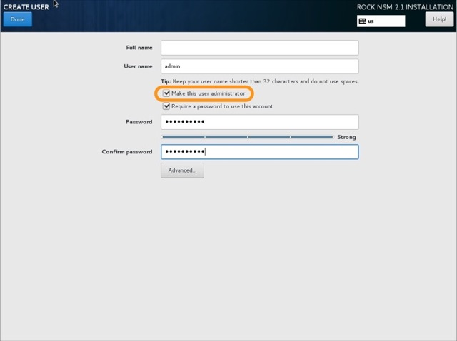

# GRASSMARLIN Install
GRASSMARLIN provides IP network situational awareness of industrial control systems (ICS) and Supervisory Control and Data Acquisition (SCADA) networks to support network security. Passively map, and visually display, an ICS/SCADA network topology while safely conducting device discovery, accounting, and reporting on these critical cyber-physical systems.

## Documentation
GrassMarlin v3.2 User Guide:  
- [Download PDF](topics/grassmarlin/GRASSMARLIN User Guide.pdf)   
- [Presentation on GRASSMARLIN](topics/grassmarlin/GRASSMARLIN_Briefing_20170210.pptx)  

## Install Instructions
1. Install RHEL on the VM you built for GRASSMARLIN in ESXi
1. Fire up the VM and boot into Anaconda (the Linux install wizard)
1. Select your language
1. Start at the bottom-left, `Network & Host Name`
    - There is the `Host Name` box at the bottom of the window, enter the GRASSMARLIN hostname from the [../platform-management.md](Platform Management) page
    - Switch the toggle to enable your NIC
      - Click `Configure` for your NIC
      - Go to `IPv4 Settings`
        - Change the `Method` to `Manual`
        - Click `Add`
          - Update your IP address, network, and gateway from the [../platform-management.md](Platform Management) page
      - Go to `IPv6 Settings` and change from `Automatic` to `Ignore`
      - Click `Save`
    - Click `Done` in the top left
1. Next the `Security Profile` in the lower right
    - Select `DISA STIG`
    - Click `Select Profile`
    - Click `Done`
1. Next click `Installation Destination`
    - Select the hard disk you want to install CentOS to, likely it is already selected unless you have more than 1 drive
    - Click `Done`
1. Click `kdump`
    - Uncheck `Enable kdump`
    - Click `Done`
1. `Installation Source` should say `Local media` and `Software Selection` should say `Minimal install` - no need to change this
1. Click `Date & Time`
    - `Region` should be changed to `Etc`
    - `City` should be changed to `Coordinated Universal Time`
    - `Network Time` should be toggled on
    - Click `Done`
    - Note - the beginning of these install scripts configures Network Time Protocol (NTP). You just did that, but it's included just to be safe because time, and DNS, matter.
    1. Click `Begin Installation`
    1. We're not going to set a Root passphrase because you will never, ever need it. Ever. Not setting a passphrase locks the Root account.
    1. Create a user from the [../platform-management.md](Platform Management) page, but ensure that you toggle the `Make this user administrator` checkbox
    
    1. Once the installation is done, click the `Reboot` button in the bottom right to...well...reboot
    1. Login using the account you created during the Anaconda setup

## Update Repository
We want to set the Nuc as the upstream repository, you can copy / paste this following code block into the Terminal.
```
sudo bash -c 'cat > /etc/yum.repos.d/local-repos.repo <<EOF
[local-epel]
name: Extra packages For Enterprise Linux Local Repo
baseurl=http://10.[state octet].10.19/epel/
gpgcheck=0
enabled=1

[local-rhel-7-server-extras-rpmsx86_64]
name: local rhel 7 server extras
baseurl=http://10.[state octet].10.19/rhel-7-server-extras-rpms/
gpgcheck=0
enabled=1

[local-rhel-7-server-optional-rpmsx86_64]
name: local rhel 7 server optional
baseurl=http://10.[state octet].10.19/rhel-7-server-optional-rpms/
gpgcheck=0
enabled=1

[local-rhel-7-server-rpmsx86_64]
name: local rhel 7 server rpms
baseurl=http://10.[state octet].10.19/rhel-7-server-rpms/
gpgcheck=0
enabled=1
```

## Install GRASSMARLIN
```
sudo yum install http://10.[state octet].10.19/grassmarlin-3.2.1-1.el6.x86_64.rpm -y
```

## Notes
 For other versions visit: https://github.com/nsacyber/GRASSMARLIN/releases
