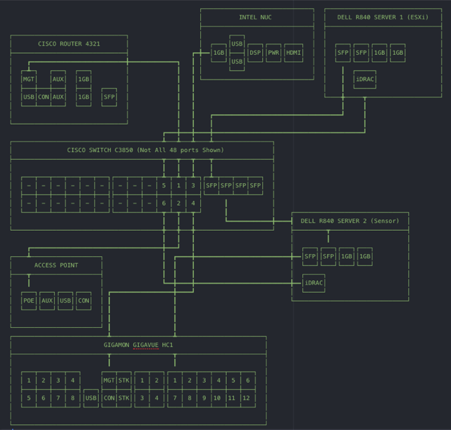

# CMAT Hardware Assembly
The CMAT kit contains [several hardware assets](hardware-components.md).


## Prereqs
- 2 people (Cases are pront ro tipping when servers have castor wheels installed)
- case on floor

# A Note about Rack Units (U's)
A Rack Unit (abbreviated U or RU) is a unit of measure defined as 1.75 in. It is most frequently used as a measurement of the overall height of 19-inch and 23-inch rack frames, as well as the height of equipment that mounts in these frames, whereby the height of the frame or equipment is expressed as multiples of rack units. For exam
ple, a typical full-size rack cage is 42U high, while equipment is typically 1U, 2U, 3U, or 4U high.

**The counting of U's starts at the bottom of the rack.**
___
# Case 1

## Step 1 - Disassemble Case
1. Remove doors from case - front and back
2. Turn knobs until unlatched
 - Open doors
 - Unhinge doors


## Step 2 - Installation of Cisco Switch - U1

 1. Attach front brackets (included) to both sides using 4 mounting holes (front and rear) and 4 short-set screws per side
  - Installing power supply into switch
  - Remove blanking from back right of switch using squeeze handles
  - Insert power supply with letters facing up until latched into place

 1. Inserting Cisco Networking module
  - Release two set screws from expansion plate right front and remove expansion plate
  - Insert network module and tighten captive bolts on front of network module (Do not over tighten)

 1. Installation of 4 SFPs
  - Insert all SFP-10G-SR modules into available SFP slots on bottom right of switch

 1. Mount switch to case
  - From front mount the switch into u3 and install 2 screws per side to attach switch to Case (use the assistance of two people)


## Step 3 - Install Server - U2 & U3

### Rail and Server Installation
Identifying the rail kit contents
To install the left rail:
1. **DO NOT** Fully extend the rear sliding bracket of the rail.
2. Position the rail end piece labeled FRONT facing inward and
orient the rear end piece to align with the holes on the rear
rack flanges.
3. Push the rail straight toward the rear of the rack until the
latch locks into place.
4. For the front end piece, rotate the latch outward and pull the
rail forward until the pins slide into the flange, and release the
latch to secure the rail in place.
5. Repeat the preceding steps to install the right rail.
6. Pull the inner rails out of the rack until they lock into place.
7. Locate the rear rail standoff on each side of the system and
lower them into the rear J-slots on the slide assemblies.
8. Install the system and ensure that the rail standoffs are seated
in the J-slots.
9. Push the system inward until the lock levers click into place.
10. Pull the blue slide release lock tabs forward on both rails and
slide the system into the rack until the system is in the rack.
11. To secure the system, push the system into the rack until the
slam latches engage and lock into the rack.

NOTE: To secure the system for shipment in the rack or
in other unstable environments, locate the hard mount
captive screw under each latch and tighten each screw
using a Phillips #2 screwdriver.

12. Release the system from the rack by lifting the slam latches
and sliding the system out of the rack.

NOTE: If applicable, use a Phillips #2 screwdriver to
unscrew the captive screws that secure the system to
the rack.To secure the rails to a square hole or unthreaded round
hole rack for shipping or in unstable environments, install the
supplied screws to the rails.

13. Insert and tighten the two screws using the Phillips #2
screwdriver to secure the back of the rails to the rack.

### Hardware Reconfiguration

1. Remove 1 of 1.6 TB SSD to the Server that will be designated as you Sensor/Baremetal/RHEL Machine/Non-ESXi


## Step 4 - Installation of Cisco Edge Router - U4
1. Remove two set screws from each side on the back of router
1. Place bracket past extending of the rear of the router and attach with four screws into side of router.
1. Insert router with the rear facing the front of the case and mount to case with four


## Step 5 - Installation of Middle Atlantic Power Supply - U5
1. Insert 4 screws to secure power supply to case

```
┌────────────────────────────────────┐
│              CASE 1                │
│ ┌────────────────────────────────┐ │
│ │     MIDDLE ATLANTIC POWER      │ │
│ ├────────────────────────────────┤ │
│ │       CISCO ROUTER 4321        │ │
│ ├────────────────────────────────┤ │
│ │        Dell R840               │ │
│ ├────────────────────────────────┤ │
│ │       CISCO SWITCH C3850       │ │
│ └────────────────────────────────┘ │
└────────────────────────────────────┘
```
___
# Case 2

## Step 1 - Dissemble Case
1. Remove doors from case - front and back
1. Turn knobs until unlatched
 - Open doors
 - Unhinge doors


## Step 2 - Installation of Gigamon - U1
 1. Attach front brackets (included) to both sides using 4 lower mounting holes and 4 short-set screws per side
 1. Attach rear hanging brackets from rear of case in U3
 1. Gigamon has 3 silver slide mounts on each side towards the rear of device
  - From front to back of case, insert slide mounts into rear mounts in U3
   - Above step may take some wiggling, side-to-side, of Gigamon
  - From front, insert 2 screws per side to attach device to case
 1. Installation of the Tap
  - Release thumb screw on far left expansion port to remove cover
  - Release thumb screw on tap prior to installation
  - Insert tap into expansion slot (should not require much force)
  - After inserting tap, close lever and tighten thumb screws
 1. Installation of 5 SFPs
  - Insert SFP 503 - 1G single mode - into slot x12
  - Insert SFP 502 - 1G multi mode - into slot x10
  - Insert SFP 501 - 1G copper - into slot X8
  - Insert SFP 533 - 10G single mode - into slot X11
  - Insert SFP 532 - 10G multi mode - into slot X9
 1. Installation of power cords
  - Gigamon has redundant power on right and left
  - Insert 2 power cords into rear right and left of Gigamon


## Step 3 - Install Server - U2 & U3
### Rail and Server Installation
Identifying the rail kit contents
To install the left rail:
1. **DO NOT** Fully extend the rear sliding bracket of the rail.
2. Position the rail end piece labeled FRONT facing inward and
orient the rear end piece to align with the holes on the rear
rack flanges.
3. Push the rail straight toward the rear of the rack until the
latch locks into place.
4. For the front end piece, rotate the latch outward and pull the
rail forward until the pins slide into the flange, and release the
latch to secure the rail in place.
5. Repeat the preceding steps to install the right rail.
6. Pull the inner rails out of the rack until they lock into place.
7. Locate the rear rail standoff on each side of the system and
lower them into the rear J-slots on the slide assemblies.
8. Install the system and ensure that the rail standoffs are seated
in the J-slots.
9. Push the system inward until the lock levers click into place.
10. Pull the blue slide release lock tabs forward on both rails and
slide the system into the rack until the system is in the rack.
11. To secure the system, push the system into the rack until the
slam latches engage and lock into the rack.

NOTE: To secure the system for shipment in the rack or
in other unstable environments, locate the hard mount
captive screw under each latch and tighten each screw
using a Phillips #2 screwdriver.

12. Release the system from the rack by lifting the slam latches
and sliding the system out of the rack.

NOTE: If applicable, use a Phillips #2 screwdriver to
unscrew the captive screws that secure the system to
the rack.To secure the rails to a square hole or unthreaded round
hole rack for shipping or in unstable environments, install the
supplied screws to the rails.

13. Insert and tighten the two screws using the Phillips #2
screwdriver to secure the back of the rails to the rack.


## Step 4 - Installation of Middle Atlantic Power Supply - U4
1. Insert 4 screws to secure power supply to case
```
┌────────────────────────────────────┐
│              CASE 2                │
│ ┌────────────────────────────────┐ │
│ │     MIDDLE ATLANTIC POWER      │ │
│ ├────────────────────────────────┤ │
│ │      DELL R840                 │ │
│ ├────────────────────────────────┤ │
│ │      GIGAMON GIGAVUE HC1       │ │
│ └────────────────────────────────┘ │
└────────────────────────────────────┘
```
___

# Hardware Wiring

|Source | Port                 | Destination |Port             |Media
|--|--|--|--|--|
|Switch | Gi1/0/1              |Router       |0/0/0            |Ethernet|
|Switch | Gi1/0/2              |AP           |POE/mGig         |Ethernet|
|Switch | Gi1/0/3              |GIGAMON      |MGMT PORT        |Ethernet|
|Switch | Gi1/0/4              |Server 1     | iDRAC           |Ethernet|
|Switch | Gi1/0/5              |Server 2     |iDRAC            |Ethernet|
|Switch | Gi1/0/6              |NUC          |Port 1           |Ethernet|
|Switch | Te1/0/1 (SR SFP)     |Server 1     | 0/0/2(SR SFP)   |Multimode Fiber|
|Switch | Te1/0/2 (SR SFP)     |Server 2     | 0/0/1(SR SFP)   |Multimode Fiber|
|Gigamon| Tool Port 1 (1/0/x11)|Server 1     | SFP Port 1      |Multimode Fiber|
s
Physical Port Assignments to VLANs

|VLAN|Port              |Description|
|--|--|--|
|10  |1-36                |Internal or Passive|
|20  |37-48               |Active|
|30  |Internal to Switch  |VPN Tunnel|
|50  |Internal to switch  |Management interface for wireless AP|
|60  |Internal to switch  |DHCP Pool for Clients|

  

Move onto [Hardware Configuration](hardware-configuration.md)
