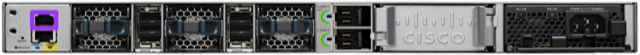

# Network Configuration

Before you start, ensure that your switch and router are [properly racked](../hardware-assembly.md)

# Initial Router Configuration (Console)
1. With a Mac or Linux system, connect a Console cable to the Console port of the switch  
  
> Console port highlighted purple

1. Connect your Console cable and go into your Terminal program (Terminal, iTerm, etc.)
```
ls /dev/*usb*
crw-rw-rw-  1 root  wheel   20, 115 Nov 29 15:06 /dev/cu.usbserial-A105LRRY (this could be slightly different on your system)
crw-rw-rw-  1 root  wheel   20, 114 Nov 29 15:06 /dev/tty.usbserial-A105LRRY (this could be slightly different on your system)
sudo cu -l /dev/cu.usbserial-A105LRRY -s 9600
```
> If you are using a different console access program, the following parameters are needed:

```
Baud Rate: 9600
Data Bits: 8
Parity: None
Stop Bits: 1
Flow Control: None
```

1. As soon as you connect, you'll be given some basic instructions on how to change the default username and passphrase. So let's do that.

Remember, the credential pairs are stored in the [platform-management page](../platform-management.md). Replace `[username]` and `[passphrase]` with the proper pair from the [platform-management page](../platform-management.md).

```
User Access Verification
Username: [default username]
Password: [default password]
Router# config t
Router(config)# username [username] privilege 15 secret 0 [password]
```

# Initial Switch Configuration (Console)
1. With a Mac or Linux system, connect a Console cable to the Console port of the switch  
  
> Console port highlighted purple

1. Connect your Console cable and go into your Terminal program (Terminal, iTerm, etc.)
```
ls /dev/*usb*
crw-rw-rw-  1 root  wheel   20, 115 Nov 29 15:06 /dev/cu.usbserial-A105LRRY (this could be slightly different on your system)
crw-rw-rw-  1 root  wheel   20, 114 Nov 29 15:06 /dev/tty.usbserial-A105LRRY (this could be slightly different on your system)
sudo cu -l /dev/cu.usbserial-A105LRRY -s 9600
```
> If you are using a different console access program, the following parameters are needed:

```
Baud Rate: 9600
Data Bits: 8
Parity: None
Stop Bits: 1
Flow Control: None
```

1. As soon as you connect, you'll be asked `Would you like to enter the initial configuration dialog? [yes/no]`, let's do that so type `yes`.

```
Would you like to enter basic management setup? [yes/no]: yes
Enter host name [Switch]: switch.mo.cmat.lan
Enter enable secret: see "platform-management.md" for the credentials to use
Enter enable password: see "platform-management.md" for the credentials to use
Enter virtual terminal password: see "platform-management.md" for the credentials to use
Do you want to configure country code? [no]: yes
Enter the country code[US]:US
Configure SNMP Network Management? [no]: no
Enter interface name used to connect to the management network from the above interface summary: vlan1
Configure IP on this interface? [yes]: yes
IP address for this interface: 10.1.10.3
Subnet mask for this interface [255.0.0.0]: 255.255.255.0
Would you like to enable as a cluster command switch? [yes/no]: no

[0] Go to the IOS command prompt without saving this config.
[1] Return back to the setup without saving this config.
[2] Save this configuration to nvram and exit.

Choose (2) to save the configuration to NVRAM to use it the next time the switch reboots.

Enter your selection [2]: 2
```

# Initial Switch Configuration (WebUI)
1. Connect a network cable to the management port on the front of the switch

> Management port highlighted purple  

1. Set your local IP address to be in the same subnet as the management IP you configured above (`10.1.10.6/24` as an example).
1. Point your browser to the management IP you set above (`http://10.1.10.3` in this example)

Move onto [Software Deployment](../software-deployment.md)
