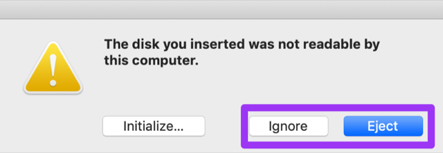

# Intel Nuc Configuration

The intel Nuc is an important part of the kits initial setup. It is used as your:
- RPM repo
- Documentation Repo
- Generally to build/rebuild and maintain the kit

# Install RedHat Enterprise Linux (RHEL)
> Note: if necessary, these steps can be replicated to work with [CentOS Minimal](http://mirror.mobap.edu/centos/7.5.1804/isos/x86_64/CentOS-7-x86_64-Minimal-1804.iso).

## Create Installation Media

### Collect RHEL

Download RHEL from the RedHat partner portal.

Now it's time to create a bootable USB drive with that fresh RHEL build.  Let's look at few options.   

### CLI

If you live in the terminal, use `dd` to apply the image.  These instructions are for using a terminal in macOS.  If you're in a different environment, google is your friend.  

:warning: Take CAUTION when using these commands by ENSURING you're writing to the correct disk / partition! :warning:

1. once you've inserted a USB get the drive ID:  
`diskutil list`  

2. unmount the target drive so you can write to it:  
`diskutil unmountDisk /dev/disk#`  

3. write the image to drive:  
`sudo dd bs=8M if=path/to/rhel.iso of=/dev/disk#`  

If this is done on a Mac, you could get a popup once the operation is complete asking you to `Initialize, Ignore, Eject` the disk. You want to `Ignore` or `Eject`. `Initialize` will add a partition to it that will allow Mac to read the disk, and make it unbootable.  
  

### Via GUI

macOS:  if using the terminal is currently a barrier to getting things rolling, [etcher.io](http://etcher.io) is an excellent GUI burning utility.  

Windows:  there are several great tools to apply a bootable image in MS land, but we recommend [rufus](https://rufus.akeo.ie/).  

## Install RHEL
This is meant to help those who need a step-by-step build of RHEL, securing SSh, and getting ready to deploy the kit services provided by the Nuc.

1. Plug the USB media into the Nuc and power on  
1. Press `F10` to enter the boot menu  
1. Select the USB drive or UEFI  
1. Boot into Anaconda (the Linux install wizard)  
1. Select your language  
1. Start at the bottom-left, `Network & Host Name`  
    - There is the `Host Name` box at the bottom of the window, enter the hostname for the Nuc from the [Platform Management](../platform-management.md) page.  
    - Switch the toggle to enable your NIC  
      - Click `Configure`  
      - Go to `IPv4 Settings` and change the Method from `Automatic` to `Manual`. Click `Add` and set  
        - the IP address from the [Platform Management](../platform-management.md) page  
        - `Netmask 255.255.255.0`  
        - and `Gateway 10.[state octet].10.19`  
      - Go to `IPv6 Settings` and change from `Automatic` to `Ignore`  
      - Click `Save`  
    - Click `Done` in the top left  
1. Next the `Security Profile` in the lower right  
    - Select `DISA STIG`  
    - Click `Select Profile`  
    - Click `Done`  
1. Next click `Installation Destination`  
    - Select the hard disk you want to install RHEL to, likely it is already selected unless you have more than 1 drive  
      - Click `Automatic Partitioning` and then click the checkbox that says `I would like to make additional space.`
      - Click `Done`  
      - There will be a popup window, in the bottom right, click `Delete All` and then `Reclaim Space`  
      - There will be a new popup window, click `Accept`  
      - Click on `Installation Destination`  
      - In the `Other Storage Options`, select `I will configure partitioning`.  
      - Click `Done`  
      - Click `Click here to create automatically.`  
      - Click on the `Red Hat Enterprise Linux Installation` carrot to dropdown your current partitions  
      - Click on `/home` and change the size to `50 G` and click `Update Settings`  
      - Click on `/` and change the size to `50 G` and click `Update Settings`  
      - Click on the `+` and set the mount point to `/var/log/audit` and set the `Desired Capacity` to `10 G`  
      - Click on the `+` and set the mount point to `/tmp` and set the `Desired Capacity` to `10 G`  
      - Click on the `+` and set the mount point to `/var` and leave the `Desired Capacity` blank  
      - You should have 7 partitions  
        - `/home` with `50 GiB`  
        - `/var/log/audit` with `10 GiB`  
        - `/tmp` with `10 GiB`
        - `/boot` with 1% of your total drive space  
        - `/` with `50 GiB`  
        - `swap` with about 1/2 of your total RAM  
        - `/var` with everything else  
    - Click `Done`  
    - Click `Accept Changes`  
1. Click `kdump`  
    - Uncheck `Enable kdump`  
    - Click `Done`  
1. `Installation Source` should say `Local media` and `Software Selection` should say `Minimal install` - no need to change this  
1. Validate `Software Selection` says `Minimal Install`  
1. Click `Date & Time`  
    - `Region` should be changed to `Etc`  
    - `City` should be changed to `Coordinated Universal Time`  
    - `Network Time` should be toggled on  
    - Click `Done`  
    - Note - the beginning of these install scripts configures Network Time Protocol (NTP). You just did that, but it's included just to be safe because time, and DNS, matter.  
1. Click `Begin Installation`  
1. We're not going to set a Root passphrase because you will not need it. Not setting a passphrase locks the Root account, which is what we want.  
1. Create a user, but ensure that you toggle the `Make this user administrator` checkbox. Use the [Platform Management](../platform-management.md) page for the user designation.  
1. Once the installation is done, click the `Reboot` button in the bottom right to...well...reboot  
1. Remove the USB device  
1. Login using the account you created during the Anaconda setup  

## Deploy Initial Configuration
Now we are going to deploy the initial configuration for the Nuc. This will configure the nuc as a repository to build the rest of the kit, as well as to store documentation.  

Before that we need some upstream packages for installation. to get those we need to grab the our RHEL subscription.

```
sudo subscription-manager register --username [see Platform Management] --password [see Platform Management] --auto-attach
```

Congrats! You have access to the RHEL RPM Repos. By extension so does the rest fo the stack.

The next script is meant to take some of the work on setting up the nuc. Using the script also ensures the rest of the kit has what it needs to function.

:warning: The next action will result in large downloads. I would not recommend completing the following action unless you have a decent internet connection and/or some time. :warning:

```
sudo sh deploy-nuc.sh
```

#### Post-Install Configuration
When you browse to Gitea for the first time, you'll enter a post-installation configuration pipeline.

* The database user will be `gitea` and the passphrase will be what you set at the beginning of the install process  
* Use the explicit IP of the Gitea server instead of `localhost` for the `Domain` and `Application URL` fields  
* Under `Server and other Services Settings` check the `Disable Avatar Service` box  


##### Configure SSH Usage

Gitea provides the ability to perform git functions via http or ssh.  In order to enable `ssh` complete the following steps:  

* edit gitea's app.ini file  
`sudo vi /opt/gitea/custom/conf/app.ini`  

make the following changes & additions to the `[server]` section:  

`START_SSH_SERVER = true`     # ensure this is set to true  
`DISABLE_SSH      = false`    # ensure this is set to false  
`SSH_PORT         = 4001`     # set this to any available port that is **NOT 22**   
`SSH_LISTEN_PORT  = 4001`     # set this to any available port that is **NOT 22**  

here's an example (showing only the `[server]` section):  
```
...

[server]
LOCAL_ROOT_URL   = http://localhost:4000/
SSH_DOMAIN       = <ip>
START_SSH_SERVER = true
DOMAIN           = <ip>
HTTP_PORT        = 4000
ROOT_URL         = http://<ip>:4000/
DISABLE_SSH      = false
SSH_PORT         = 4001
SSH_LISTEN_PORT  = 4001
LFS_START_SERVER = true
LFS_CONTENT_PATH = /opt/gitea/data/lfs
LFS_JWT_SECRET   = xxxxxxxxxxxxxxxxxxx
OFFLINE_MODE     = false

...:
```
##### Wrapping it up
```
sudo firewall-cmd --add-port=4001/tcp --permanent
sudo firewall-cmd --reload
sudo systemctl restart gitea
sudo systemctl restart sshd
```

Once the post installation steps have been completed then we need to clone a few git repos to ensure we have what we need to build ROCK. Navigate to `10.[state].10.19:4000` or `nuc.[STATE].cmat.lan:4000` if you already have dns setup in accordance with the documentation.

Mirror the following Repositories in gitea

 - rock-scripts https://github.com/rocknsm/rock-scripts.git
 - rock-dashboards https://github.com/rocknsm/rock-dashboards.git
 - CAPES https://github.com/capesstack/capes.git
 - Rock https://github.com/rocknsm/rock.git
 - Any Repos you have for quick references
## Download Iso images

Coordinate with the CMAT technical lead to coordinate receipt of the following iso images:
 - RHEL - DVD iso (Should have this one already downloaded from Nuc installation)
 - ESXi ISO

Move onto [Gigamon Configuration](../gigamon/README.md)
