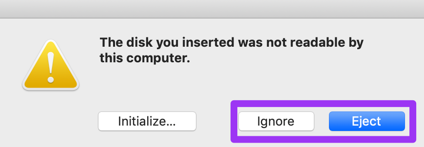

# Install RedHat Enterprise Linux (RHEL)
> Note: if necessary, these steps can be replicated to work with [CentOS Minimal](http://mirror.mobap.edu/centos/7.5.1804/isos/x86_64/CentOS-7-x86_64-Minimal-1804.iso).

## Create Installation Media

### Collect RHEL

Download RHEL from the RedHat partner portal.

Now it's time to create a bootable USB drive with that fresh RHEL build.  Let's look at few options.   

### CLI

If you live in the terminal, use `dd` to apply the image.  These instructions are for using a terminal in macOS.  If you're in a different environment, google is your friend.  

:warning: Take CAUTION when using these commands by ENSURING you're writing to the correct disk / partition! :warning:

1. once you've inserted a USB get the drive ID:  
`diskutil list`  

2. unmount the target drive so you can write to it:  
`diskutil unmountDisk /dev/disk#`  

3. write the image to drive:  
`sudo dd bs=8M if=path/to/rhel.iso of=/dev/disk#`  

If this is done on a Mac, you could get a popup once the operation is complete asking you to `Initialize, Ignore, Eject` the disk. You want to `Ignore` or `Eject`. `Initialize` will add a partition to it that will allow Mac to read the disk, and make it unbootable.  
{#id .class width=70%}  

### Via GUI

macOS:  if using the terminal is currently a barrier to getting things rolling, [etcher.io](http://etcher.io) is an excellent GUI burning utility.  

Windows:  there are several great tools to apply a bootable image in MS land, but we recommend [rufus](https://rufus.akeo.ie/).  

## Install RHEL

### Partition Schemes for Each RHEL Device
Use the Platform Management doc and the table below to confiure the RHEL OSs. If they need to be in a specific volume group then they will be denoted inside `()` otherwise assume it is part of the default `rhel` volume group

| Device            |  /     | /tmp     | /var/log/audit | /boot  | /home          | /swap | /var           | /data               | /data/stenographer | /data/kafka|
|--|--|--|--|--|--|--|--|--|--|--|
| Nuc               | 5GB    | 1 GB     |2GB             |Default |50GB            |Default|Remaining Space |NA                   |NA                  |NA|
| Sensor (Server 1) | 50GB   | 10GB     |10GB            |Default |50 GB           |Default|10GB            |Remaining Space(fast)|6.8 TB (fast)       |~1.5 TB (faster)|
| ES Nodes          | 50GB   | 25GB     |10GB            |default |50GB            |8GB    |25GB            |Remaining Space      |NA                  |NA|
| GrassMarlin       | 5GB    | 1GB      |1GB             |Default |Remaining Space |Default|15GB            |NA                   |NA                  |NA|
| OpenVAS           | 5GB    | 1GB      |2 GB            |Default |Remaining Space |Default|15GB            |NA                   |NA                  |NA|
| DNS               | 5GB    | 2GB      |2 GB            |Default |Remaining Space |Default|2GB             |NA                   |NA                  |NA|

### Volume Group Table
|Volume Group | Media|
|--|--|
|FAST| RAID 0 SSD |
|FASTER| NVME |
|OS| Stand Alone 240 GB SSD |

This is meant to help those who need a step-by-step build of RHEL.

>NOTE: Capes has its own installation criteria, please refer to [Capes Installation](capes/README.md).

1. Attach or insert the media and power on  
1. Press `F10` to enter the boot menu  
1. Select the media  
1. Boot into Anaconda (the Linux install wizard)  
1. Select your language  
1. Start at the bottom-left, `Network & Host Name`  
    - There is the `Host Name` box at the bottom of the window, enter the hostname for the installation from the [Platform Management](../platform-management.md) page.  
    - Switch the toggle to enable your NIC  
      - Click `Configure`  
      - Go to `IPv4 Settings` and change the Method from `Automatic` to `Manual`. Click `Add` and set  
        - the IP address from the [Platform Management](../platform-management.md) page    
    - Click `Done` in the top left  
1. Next the `Security Profile` in the lower right  
    - Select `DISA STIG`  
    - Click `Select Profile`  
    - Click `Done`  
1. Next click `Installation Destination`  
    - Select the hard disk you want to install RHEL to, likely it is already selected unless you have more than 1 drive  
      - Click `Automatic Partitioning` and then click the checkbox that says `I would like to make additional space.`
      - Click `Done`  
      - There will be a popup window, in the bottom right, click `Delete All` and then `Reclaim Space`  
      - There will be a new popup window, click `Accept`  
      - Click on `Installation Destination`  
      - In the `Other Storage Options`, select `I will configure partitioning`.  
      - Click `Done`  
      - Click `Click here to create automatically.`
      - Under `Device type` select `lvm`.
      - **If** required, Create any additional volume groups
          - Under the `Volume Group` select `Create New Volume Group`
          - Give it the required name (OS,FAST,FASTER)
          - Assign the appropriate disks according to above Volume Group Table
          - Hit `Save`
      - Click on the `Red Hat Enterprise Linux Installation` carrot to dropdown your current partitions  
      - Click on `/home` and change the size to desired size and click `Update Settings`  
      - Click on `/` and change the size to desired size and click `Update Settings`  
      - Click on the `+` and set the mount point to `/var/log/audit` and set the `Desired Capacity` to desired size  
      - Click on the `+` and set the mount point to `/tmp` and set the `Desired Capacity` to desired size  
      - Click on the `+` and set the mount point to `/var` and leave the `Desired Capacity` blank
      - **If** required, Click on the `+` and set the mount point to `/data` and set to desired size
      - **If** required, Click on the `+` and set the mount point to `/data/stenographer` and and set to desired size
      - **If** required, Click on the `+` and set the mount point to `/data/kafka` and and set to desired size
      - Check partitions against above table  
        - Click `Done`  
    - Click `Accept Changes`  
1. Click `kdump`  
    - Uncheck `Enable kdump`  
    - Click `Done`  
1. `Installation Source` should say `Local media` and `Software Selection` should say `Minimal install` - no need to change this  
1. Validate `Software Selection` says `Minimal Install`  
1. Click `Date & Time`  
    - `Region` should be changed to `Etc`  
    - `City` should be changed to `Coordinated Universal Time`  
    - `Network Time` should be toggled on  
    - Click `Done`

1. Click `Begin Installation`  
1. We're not going to set a Root passphrase because you will not need it. Not setting a passphrase locks the Root account, which is what we want.  
1. Create a user, but ensure that you toggle the `Make this user administrator` checkbox. Use the [Platform Management](../platform-management.md) page for the user designation.  
1. Once the installation is done, click the `Reboot` button in the bottom right to...well...reboot  
1. Remove the USB device  
1. Login using the account you created during the Anaconda setup  


> For every machine except the NUC and capes (which uses elastic 5 instead of 6) need the following rpm repo file needs to be created.

1. Add local repos to RHEL.

  ```
  sudo bash -c 'cat > /etc/yum.repos.d/local-repos.repo <<EOF
  [copr-rocknsm-2.1]
  name: copr rocknms repo
  baseurl=http://10.[state octet].10.19/copr-rocknsm-2.1/
  gpgcheck=0
  enabled=1

  [local-epel]
  name: Extra packages For Enterprise Linux Local Repo
  baseurl=http://10.[state octet].10.19/epel/
  gpgcheck=0
  enabled=1

  [local-rhel-7-server-extras-rpmsx86_64]
  name: local rhel 7 server extras
  baseurl=http://10.[state octet].10.19/rhel-7-server-extras-rpms/
  gpgcheck=0
  enabled=1

  [local-rhel-7-server-optional-rpmsx86_64]
  name: local rhel 7 server optional
  baseurl=http://10.[state octet].10.19/rhel-7-server-optional-rpms/
  gpgcheck=0
  enabled=1

  [local-rhel-7-server-rpmsx86_64]
  name: local rhel 7 server rpms
  baseurl=http://10.[state octet].10.19/rhel-7-server-rpms/
  gpgcheck=0
  enabled=1

  [local-elastic-6.x]
  name: elastic
  baseurl=http://10.[state octet].10.19/elastic-6.x/
  gpgcheck=0
  enabled=1

  [local-rock2]
  name: elastic
  baseurl=http://10.[state octet].10.19/rock2/
  gpgcheck=0
  enabled=1

  EOF'
  ```

1. Continue installation...
