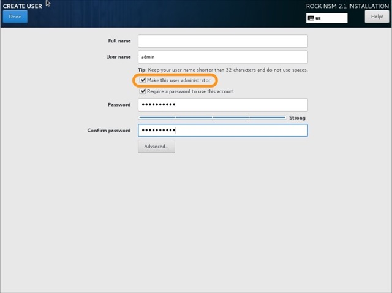

# Installation Guide for Rock


## prereqs:
 - Installation media
  - RHEL
  - ESXi
___
## Preparing Media

If not already done move one of the SSD to the server that will be your sensor. This ensures you have enough room for your PCAP for stenographer

## Apply the Image

Now it's time to create a bootable USB drive with RHEL/ESXi.  Let's look at few options.   

### CLI

If you live in the terminal, use `dd` to apply the image.  These instructions are for using a terminal in macOS.  If you're in a different environment, google is your friend.  

:warning: Take CAUTION when using these commands by ENSURING you're writing to the correct disk / partition! :warning:

1. once you've inserted a USB get the drive ID:  
`diskutil list`  

2. unmount the target drive so you can write to it:  
`diskutil unmountDisk /dev/disk#`  

3. write the image to drive:  
`sudo dd bs=8M if=path/to/rockiso of=/dev/disk#`  

### Via GUI

macOS:  if using the terminal is currently a barrier to getting things rolling, [etcher.io](http://etcher.io) is an excellent GUI burning utility.  

Windows:  there are several great tools to apply a bootable image in MS land, but we recommend [rufus](https://rufus.akeo.ie/).  


### Date & Time

UTC is generally preferred for logging data as the timestamps from anywhere in the world will have a proper order without calculating offsets. That said, Kibana will present the Bro logs according to your timezone (as set in the browser). The bro logs themselves (i.e. in `/data/bro/logs/`) log in epoch time and will be written in UTC regardless of the system timezone.

Bro includes a utility for parsing these on the command line called `bro-cut`. It can be used to print human-readable timestamps in either the local sensor timezone or UTC. You can also give it a custom format string to specify what you'd like displayed.

### Network Setup


#### - Sensor Setup

Before beginning the install process it's best to connect the interface you've selected to be the **management interface**.  Here's the order of events:  

1. ROCK will initially look for an interface with a default gateway and treat that interface as MGMT
2. All remaining interfaces will be treated as MONITOR

> This will be the 2 ethernet cables running from the gigamon to the back of the server in the same case (sensor)


Ensure that the interface you intend to use for MGMT has been turned on and has a static IP and proper name outlined in [Platform Management page](../platform-management.md)


#### - Data Tier (ESXi) Setup

There will not be any monitor interfaces only the management interfaces. Ensure a management interface is set with a static IP and proper name outlined in [Platform Management page](../platform-management.md)

### Security profiles
 Apply the DISA STiG


### Partitioning

#### - Sensor Setup

There partitioning will differ for each server. The main focus for storage on the sensor is for stenographer to retain pcap. The data tier will need space to retain all the indexed information form the sensor and distribute the load amongst the 3 elastic nodes.

  Set up the partitions as follows:
    - /data  = everything else from steno
    - /data/stenographer/ = 7TB ssd
    - /data/kafka = 1.6 TB nvme only
    - / = 50 GB ssd
    - /home = everything else ssd
    - /var = 30 GB ssd
    - /var/log/audit = 25 GB ssd
    - /tmp  = 10 GB ssd
    - /boot = default ssd

#### - Data Tier (Any Elasticsearch Node)

  Set up the partitions as follows:
    - /data  = everthing else ssd <--- Elastic lives here
    - / = 50 GB ssd
    - /home = 50 GB ssd
    - /var = 10 GB ssd
    - /var/log/audit = 10 GB ssd
    - /tmp  = 10 GB ssd
    - /boot = default ssd

  Setup the LVM Cache as follows:
    - Step 1-7 TODO


### User Creation

Leave the root user disabled.  We recommend that you leave it that way.  Once you've kicked off the install, click **User Creation** at the next screen (shown above) and complete the required fields to set up a non-root admin user.  



> If this step is not completed now do not fear, you will be prompted to create this account after first login.

- click **Finish Installation** and wait for reboot
- accept license agreement: `c` + `ENTER`


## Repo Changes

### Update Repository
Once the sensor reboots we need to start the deployment rock. since rock is by default buil;t on CENTOS vs RHEL and we are accomplishing this in offline vs online, we want to set the Nuc as the upstream RHEL repository You can copy / paste this following code block into the Terminal.


```
sudo bash -c 'cat > /etc/yum.repos.d/local-repos.repo <<EOF
[atomic]
name: Atomic for OpenVAS
baseurl=http://10.1.10.19/atomic/
gpgcheck=0
enabled=1

[capes]
name: Capes Local
baseurl=http://10.1.10.19/capes/
gpgcheck=0
enabled=1

[copr-rocknsm-2.1]
name: copr rocknms repo
baseurl=http://10.1.10.19/copr-rocknsm-2.1/
gpgcheck=0
enabled=1

[local-epel]
name: Extra packages For Enterprise Linux Local Repo
baseurl=http://10.1.10.19/epel/
gpgcheck=0
enabled=1

[local-rhel-7-server-extras-rpmsx86_64]
name: local rhel 7 server extras
baseurl=http://10.1.10.19/rhel-7-server-extras-rpms/
gpgcheck=0
enabled=1

[local-rhel-7-server-optional-rpmsx86_64]
name: local rhel 7 server optional
baseurl=http://10.1.10.19/rhel-7-server-optional-rpms/
gpgcheck=0
enabled=1

[local-rhel-7-server-rpmsx86_64]
name: local rhel 7 server rpms
baseurl=http://10.1.10.19/rhel-7-server-rpms/
gpgcheck=0
enabled=1

[local-wandiscox86_64]
name: wandisco
baseurl=http://10.1.10.19/WANdisco-git/
gpgcheck=0
enabled=1

[local-elastic-6.x]
name: elastic
baseurl=http://10.1.10.19/elastic-6.x/
gpgcheck=0
enabled=1

EOF'

```

Ensure that the local repo has been added
```
yum repolist all
```

The last step before configuring sensor settings is to update the base OS to current: `sudo yum update -y && reboot`  


Move onto [Rock NSM Deploy](rhelrocksoftwaredeploy.md).
