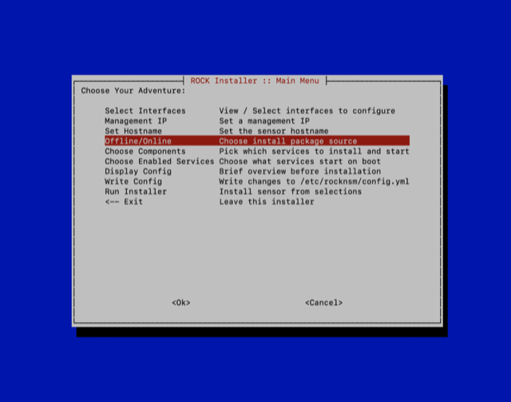
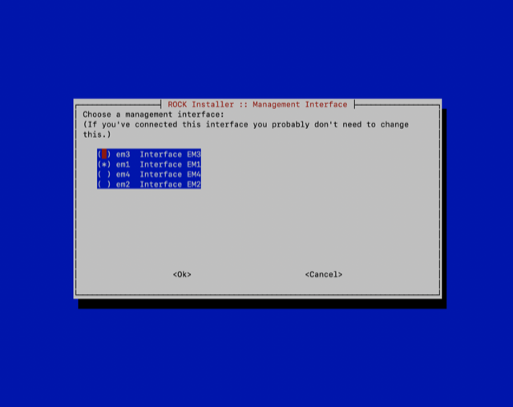
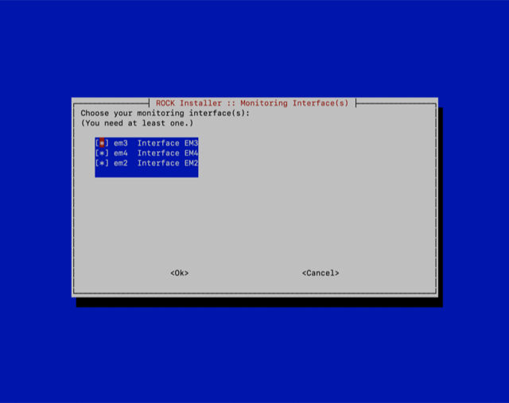
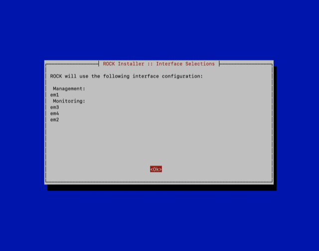
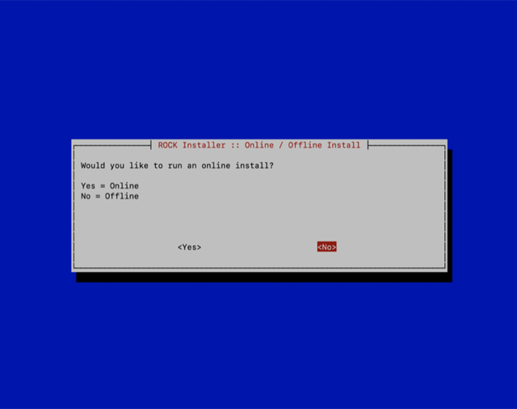

# RockNSM Deploymenmt
This will cover the deployment of the RockNSM sensor/data node elements. This installation is for the ROCKNSM iso.

## Prereqs
 - ESXi installed
 -  login ability to log in and ssh into every system
 - DNS Setup
 - Connectivity of all servers
### Install OS
> NOTE: add flags to Anaconda Preinstall **IF** any of the nodes are Virtual Machines

When you boot the installer, called Anaconda. Before it boots, press and append the following, which disables physical NIC naming and sets the screen resolution that is better for VMware.

  net.ifnames=0 vga=791

Install OS in accordance with RHEL Documentation

---

#### Disable FIPS to allow Deployment on all components

1. Disable FIPS

  1. Remove the dracut-fips* packages
  ```
  sudo yum remove dracut-fips\*
  ```

  1. Backup existing FIPS initramfs
  ```
  sudo mv -v /boot/initramfs-$(uname -r).img{,.FIPS-bak}
  ```

  1. Run dracut to rebuild the initramfs
  ```
  sudo dracut
  ```

  1. Run Grubby
  ```
  sudo grubby --update-kernel=ALL --remove-args=fips=1
  ```

  1. Carefully up date the grub config file setting fips=0
  ```
  sudo vi /etc/default/grub
  ```

  1. Reboot the VM
  ```
  sudo reboot
  ```

  1. Log back in...

  1. Confirm that fips is disabled by
  ```
  sysctl crypto.fips_enabled
  ```

    if it returns 0 then it has been properly disabled

#### Sync the Clocks across all machines
Due to the nature of virtual machines we have to keep the VMs and Baremetal equipment in sync. To this we set the sensor as the authority for time for the rest of the kit. We do this for a couple of reasons the biggest being that its is where the time-based data is generated from zeek(Bro), FSF, and Suricata. Aligning the rest of the stack along this guideline keeps us from writing events in the future. all events should be written in UTC to help with response across timezones. This is done via chrony.

1. Add ntp to the firewall on sensor
```
sudo firewall-cmd --add-service=ntp --zone=work --permanent
```

1. Reload the firewall
```
sudo firewall-cmd --reload
```

#### Deployment of Rock across All Machines
> NOTE: The new playbooks in 2.4.0 are made to handle multi node deployments. We will be able to deploy several machines at the same time.
Generate a hosts.ini file that so ansible knows where to deploy things sudo vi /etc/rocknsm/hosts.ini

> NOTE: If not already done then log into every server that rock will be deployed to so that the key can be added to the ssh hosts file.

1. Insert the following text. These will tell the script what to deploy and where


```
sensor.[state].cmat.lan ansible_host=10.[state].10.21 ansible_connection=local
es1.[state].cmat.lan ansible_host=10.[state].10.25 ansible_connection=local
es2.[state].cmat.lan ansible_host=10.[state].10.26 ansible_connection=local
es3.[state].cmat.lan ansible_host=10.[state].10.27 ansible_connection=local

[rock]
sensor.[state].cmat.lan

[web]
es1.[state].cmat.lan
es2.[state].cmat.lan
es3.[state].cmat.lan

[sensors:children]
rock

[bro:children]
sensors

[fsf:children]
sensors

[kafka:children]
sensors

[stenographer:children]
sensors

[suricata:children]
sensors

[zookeeper]
sensor.[state].cmat.lan

[elasticsearch:children]
es_masters
es_data
es_ingest

[es_masters]
es[1:3].[state].cmat.lan

[es_data]
es[1:3].[state].cmat.lan

[es_ingest]
es[1:3].[state].cmat.lan

[elasticsearch:vars]
# Disable all node roles by default
node_master=false
node_data=false
node_ingest=false

[es_masters:vars]
node_master=true

[es_data:vars]
node_data=true

[es_ingest:vars]
node_ingest=true

[docket:children]
web

[kibana:children]
web

[logstash:children]
sensors
```

Most of the Rock configuration is now automated and can be called from anywhere on the os. Below are the options. Run `sudo rock ssh-config` to setup all the hosts prior to deploying.
  
```
[admin@sensor ~]$ sudo rock help
Usage: /sbin/rock COMMAND [options]
Commands:
setup               Launch TUI to configure this host for deployment
tui                 Alias for setup
ssh-config          Configure hosts in inventory to use key-based auth (multinode)
deploy              Deploy selected ROCK components
deploy-offline      Same as deploy --offline (Default ISO behavior)
deploy-online       Same as deploy --online
stop                Stop all ROCK services
start               Start all ROCK services
restart             Restart all ROCK services
status              Report status for all ROCK services
genconfig           Generate default configuration based on current system
destroy             Destroy all ROCK data: indexes, logs, PCAP, i.e. EVERYTHING
                      NOTE: Will not remove any services, just the data

Options:
--config, -c <config_yaml>         Specify full path to configuration overrides
--extra, -e <ansible variables>    Set additional variables as key=value or YAML/JSON passed to ansible-playbook
--help, -h                         Show this usage information
--inventory, -i <inventory_path>   Specify path to Ansible inventory file
--limit <host>                     Specify host to run plays
--list-hosts                       Outputs a list of matching hosts; does not execute anything else
--list-tags                        List all available tags
--list-tasks                       List all tasks that would be executed
--offline, -o                      Deploy ROCK using only local repos (Default ISO behavior)
--online, -O                       Deploy ROCK using online repos
--playbook, -p <playbook_path>     Specify path to Ansible playbook file
--skip-tags <tags>                 Only run plays and tasks whose tags do not match these values
--tags, -t <tags>                  Only run plays and tasks tagged with these values
--verbose, -v                      Increase verbosity of ansible-playbook
```
1. Start the interactive text interface for setup using `sudo rock tui`

1. Select "Select Interfaces". This allows you to choose which interface that you will manage and capture with.


1. Choose you management interface


1. Choose you capture interface(s).

> NOTE: Any interface you set for cature will spawn a Bro/Zeek, Surcata, and FSF process. So if you dont intend on using the interface do not set it for capture.

1. You will then be forwarded to the interface summary screen. make sure all the things are to your satisfaction


1. Once it has returned to the installation setup screen then choose the  "Offline/Online" installation option. This tells the installation playbook where to pull the packages. As these kits are meant to be offline we will choose the offline installation option.


1. Choose "No" for the offline installation.


1. Once it has returned to the installation setup screen then choose the  "Choose Components" installation option.


1. Here is where you decide what capabilities your sensor will have. If you are low on resources the the recommendation is to disable docket and stenographer. Otherwise just enable everything.


1. Once it has returned to the installation setup screen then choose the  "Choose enabled services" installation option. This needs to match the installed components unless you have a specific reason to do so.


1. This will write the config to the ansible deployment script.

1. Once it has returned to the installation setup screen then choose the  "Run Installer" installation option.

1. Setup you ssh access to you machine using sudo rock ssh-config command or using sudo rock tui for the Text user interfaces
**It should complete with no errors**

1. Ensure the following ports on the firewall are open for the data nodes

  - 9300 TCP - Node coordination (I am sure elastic has abetter name for this)
  - 9200 TCP - Elasticsearch
  - 5601 TCP - Only on the elasticsearch node that has kibana installed, Likely es1.[STATE].cmat.lan
  - 22 TCP - SSH Access
  ```
  sudo firewall-cmd --add-port=9300/tcp --permanent
  ```

1. Reload the firewall config
```
sudo firewall-cmd --reload
```

1. Ensure the following ports on the firewall are open for the sensor
  - 1234 tcp/udp - NTP
  - 22 TCP - SSH Access
  ```
  sudo firewall-cmd --add-port=9300/tcp --permanent
  ```

1. Reload the firewall config
```
sudo firewall-cmd --reload
```


1. Restart services with `sudo rock stop` and the `sudo rock start`

Move onto [USAGE](../topics/rocknsm/rocknsm2-4-0/CENTOS/rocknsm-usage.md)
