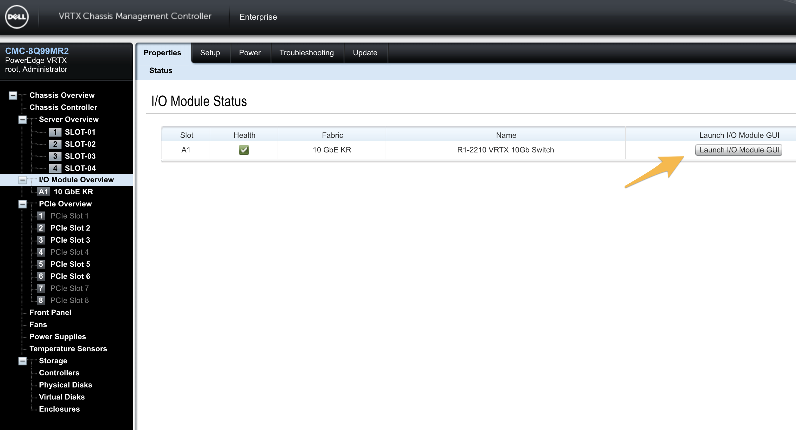
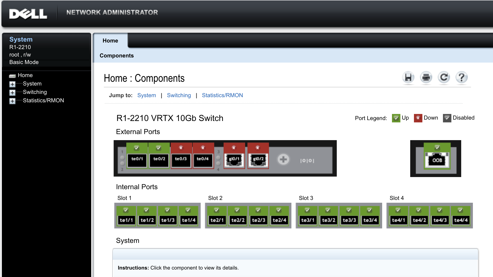
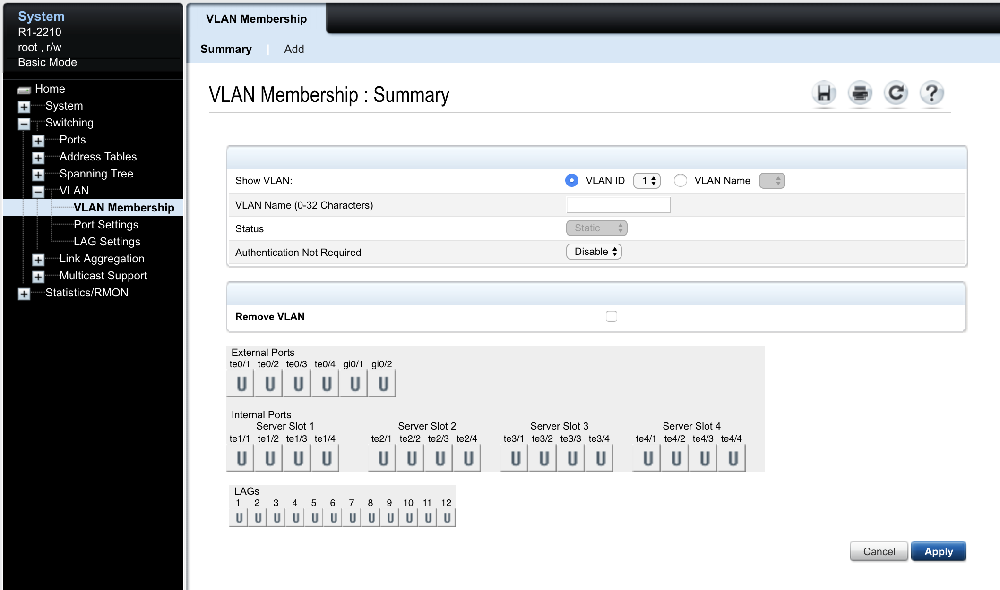
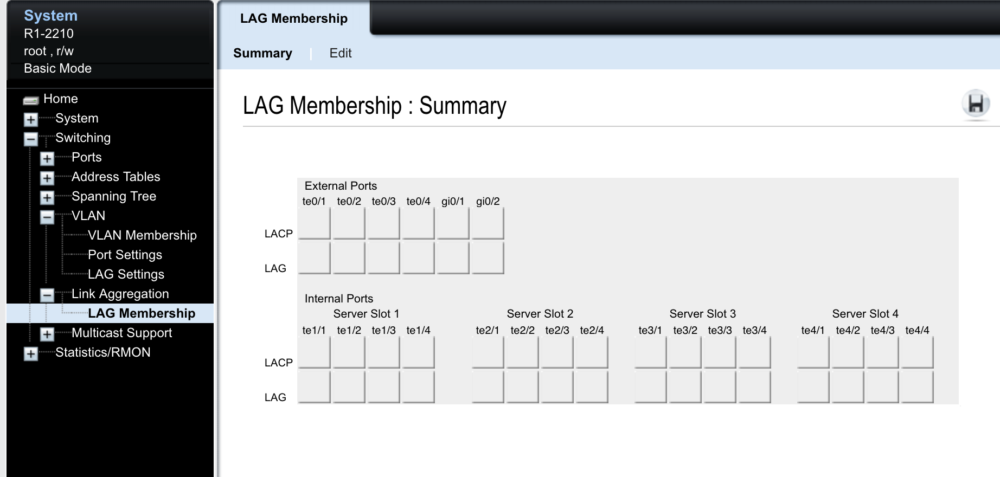
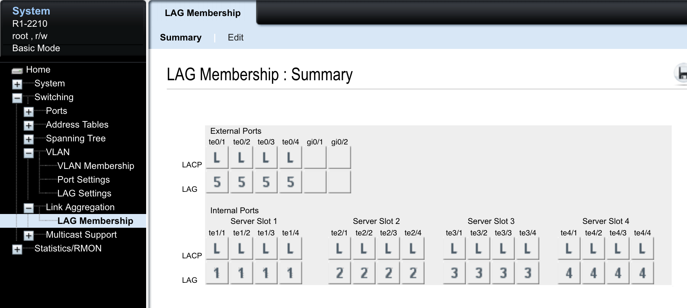
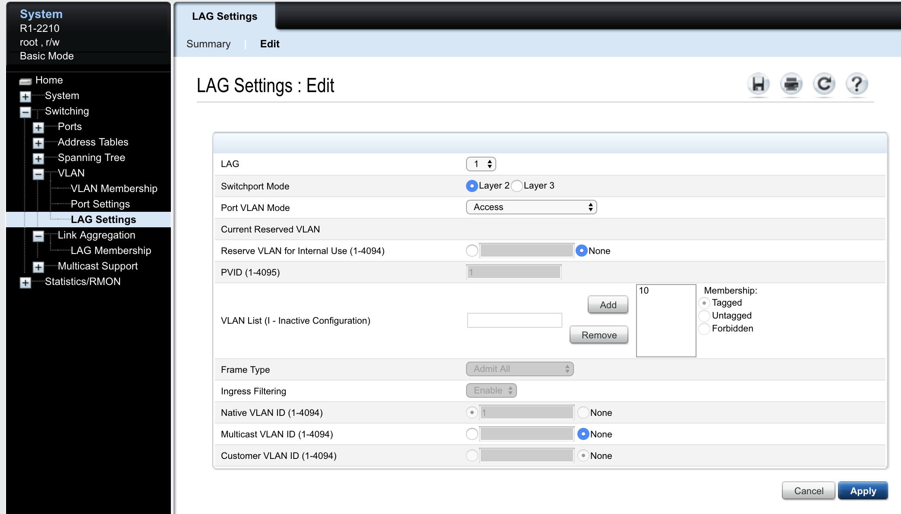
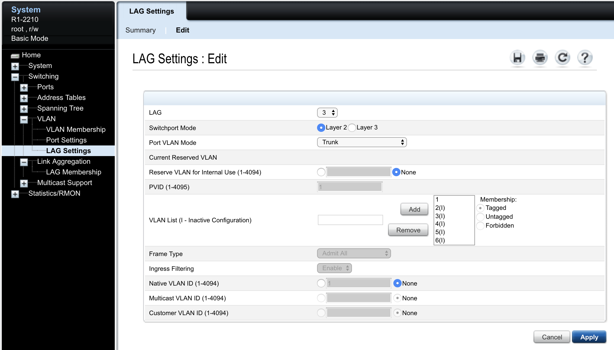
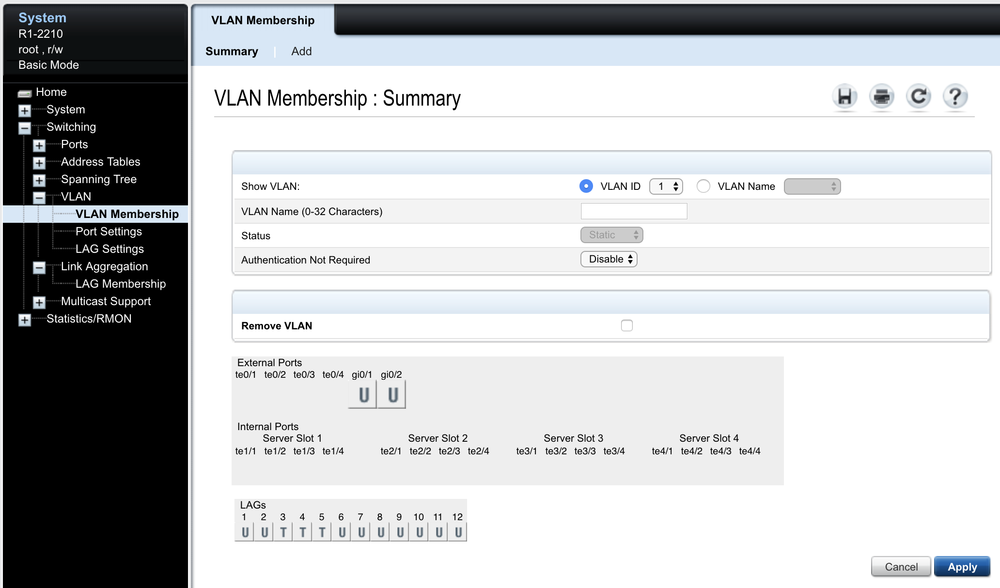

In the CMC, go to the I/O Module Overview. In the line for the `R1-2210 VRTX 10Gb Switch`, click the `Launch I/O Module GUI`.

Login with the default credentials `root` and `calvin`. This will bring you to the Dell switch home screen.

## Add VLANs

Expand in the sidebar to `Switching -> VLAN -> VLAN Membership`. Then click `Add` to create new VLANs on the switch.

Add the following VLANs:

VLAN  |  Description
------|---------------
10    |  Internal
20    |  Active

---
## Create Link Aggregation Groups (LAGs)

Create LAG groups with LACP for each of the internal server slots, and also the external 10G ports. This should result in a configuration that looks like the following:

## Configure VLAN Trunking and Access ports

The LAG for the sensor blades (1 and 2) will be access ports in VLAN 10. You have to remove VLAN 1 from the VLAN list first, then you can set it to 10. The resulting configuration should look like this.

The LAG for the hypervisor blades and external LAG will operate in trunk mode with no native VLANs.

The end result summary should look like the following.

**NOTE**: You can change the VLAN in this view to see the settings per each VLAN. `T` means that VLAN will be tagged on that port. `U` means it will be untagged on that port. Blank means it is an access port in that VLAN. A trunk port should have all VLANs that you wish to pass with a setting of `T`.

