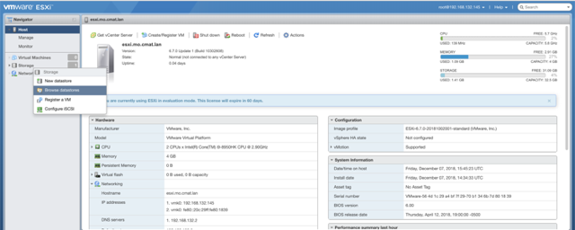
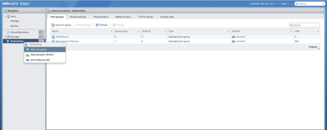

# VMWare ESXi Configuration

Before you start, ensure that your server is [properly racked](../hardware-assembly.md)

VMware ESXi is a purpose-built bare-metal hypervisor that installs directly onto a physical server. With direct access to and control of underlying resources, ESXi is more efficient than hosted architectures and can effectively partition hardware to increase consolidation ratios.

# Install ESXi

## Collect ESXi

Download ESXi from the VMWare portal.

Now it's time to create a bootable USB drive with that fresh ESXi build.  Let's look at few options.   

### CLI

If you live in the terminal, use `dd` to apply the image.  These instructions are for using a terminal in macOS.  If you're in a different environment, Google is your friend.  

:warning: Take CAUTION when using these commands by ENSURING you're writing to the correct disk / partition! :warning:

1. once you've inserted a USB, get the drive ID:  
`diskutil list`  

2. unmount the target drive so you can write to it:  
`diskutil unmountDisk /dev/disk#`  

3. write the image to drive:  
`sudo dd bs=8M if=path/to/esxi.iso of=/dev/disk#`  

If this is done on a Mac, you could get a popup once the operation is complete asking you to `Initialize, Ignore, Eject` the disk. You want to `Ignore` or `Eject`. `Initialize` will add a partition to it that will allow Mac to read the disk, and make it unbootable.  
  

### Via GUI

**MacOS:**  if using the terminal is currently a barrier to getting things rolling, [etcher.io](https://www.balena.io/etcher/) is an excellent GUI burning utility.  
**Windows:**  there are several great tools to apply a bootable image in MS land, but we recommend [rufus](https://rufus.akeo.ie/).  

## Installation Instructions

1. Load the ESXi installer media in a physical or virtual drive on your host machine and restart the host machine  
2. Set the BIOS to boot from the media  
3. Select the ESXi installer in the boot menu and press Enter  
4. To accept the EULA, press `F11`  
5. Select the `OS` drive on which to install ESXi and press Enter  
6. To select the default keyboard layout for the host, press Enter  
7. To set the host password in accordance with the [Platform Management](../platform-management.md) page  
8. To begin installation, press `F11`  
9. After the installation finishes, remove the installation media and press Enter to restart the host

# Post Installation Configuration

1. After the system reboots, you will be at the default ESXi landing page  
2. Press `F2` and log in as `root` and use your passphrase stored on the [Platform Management](../platform-management.md) page  
3. Go down to `Configure Management Network`  
4. Go down to `IPv4 Configuration`  
5. Ensure that `Set static IPv4 address and network configuration` is set (you can toggle it by selecting it and pressing the `Space` bar)  
6. Enter the `IPv4 Address`, `Subnet Mask`, and `Default Gateway`, and press `Enter`
7. Go down and select `DNS Configuration`  
8. Enter your DNS and hostname information from the [Platform Management](../platform-management.md) page and press `Enter`  
9. Press `esc`, then `Y` to save your changes and restart your management interface  
10. Go down and select `Test Management Network` and ping your gateway IP from the [Platform Management](../platform-management.md) page to validate the settings  
11. Press `esc` to log out  

# Upload Media to Datastore
> Note: this could be a bit different, specifically around the Storage considerations. I recommend you update the documentation with your specific environment.  

1. Point your browser to `https://esxi1.[STATE].cmat.lan` from the [Platform Management](../platform-management.md) page  
2. Log in with your user credential pair from the [Platform Management](../platform-management.md) page  
3. Right-click on `Storage` and select `Browse datastores`  
  
4. Click on `Create directory` and make a new directory called `iso`  
1. Click on the new `iso` folder and click `Upload`  
1. Upload your RHEL, when that's done, click `Close`  

# Create Networking Ports
1. On the Configure tab, expand Networking and select Virtual switches.
Click Add host networking.
1. Select a connection type for which you want to use the new standard switch and click Next.
1. Add physical network adapter `vmnic0`.
Virtual Machine Port Group for a Standard Switch
1. Click OK.
1. Right-Click on `Networking` and select `Add port group`  
  
1. Enter the following:
  - Name: `Passive`  
  - VLAN ID: `10`  
  - Virtual switch: `vSwitch0`  
  - Security: `Inherit from vSwitch`  
1. Enter the following:
  - Name: `Management`  
  - VLAN ID: `10`  
  - Virtual switch: `vSwitch0`  
  - Security: `Inherit from vSwitch`  
1. Enter the following:
  - Name: `Active`  
  - VLAN ID: `20`  
  - Virtual switch: `vSwitch0`  
  - Security: `Inherit from vSwitch`  

# Create the CAPES Virtual Machine
1. Right-Click on `Virtual Machines` and select `Create/Register VM`  
  
  - Name: `CAPES`  
  - Compatibility: Leave default  
  - Guest OS Family: `Linux`  
  - Guest OS Version: `Red Hat Enterprise Linux 7 (64-bit)`  
1. Click `Next` to create new virtual machine
1. Select your storage  
1. Customize the VM  
  - CPU: `2`  
  - Memory: `3 GB`,  Reserved
  - Hard disk 1: `50 GB`  
  - SCSI Controller 0: Leave default  
  - SATA Controller 0: Leave default  
  - USB controller 1:  Leave default  
  - Network Adapter: `Passive`, ensure that `Connect` is enabled  
  - CD/DVD Drive 1: `Datastore ISO file`, select the RHEL ISO you uploaded above, ensure that `Connect` is enabled  
  - Video Card:  Leave default  
1. Review your settings  
1. Click Finish

# Create the RHEL DNS
1. Right-Click on `Virtual Machines` and select `Create/Register VM`  
  
  - Name: `RHEL DNS`  
  - Compatibility: Leave default  
  - Guest OS Family: `Linux`  
  - Guest OS Version: `Red Hat Enterprise Linux 7 (64-bit)`  
1. Select your storage  
1. Customize the VM  
  - CPU: `1`  
  - Memory: `2 GB` , Reserved
  - Hard disk 1: `16 GB`  
  - SCSI Controller 0: Leave default  
  - SATA Controller 0: Leave default  
  - USB controller 1:  Leave default  
  - Network Adapter: `Passive`, ensure that `Connect` is enabled  
  - CD/DVD Drive 1: `Datastore ISO file`, select the RHEL ISO you uploaded above, ensure that `Connect` is enabled  
  - Video Card:  Leave default  
1. Review your settings  
1. Click Finish  

# Create the Sensor Data Tier Virtual Machine
> Note: You're going to create three of these named "data-tier-[1, 2, and 3]"

1. Select `Create/Register VM`  
  - Name: `data-tier-[#]`  
  - Compatibility: Leave default  
  - Guest OS Family: `Linux`  
  - Guest OS Version: `Red Hat Enterprise Linux 7 (64-bit)`  
1. Select your storage  
1. Customize the VM  
  - CPU: `12`  
  - Memory: `12 GB` , Reserved   
  - Hard disk 1: `1 TB`  
  - SCSI Controller 0: Leave default  
  - SATA Controller 0: Leave default  
  - USB controller 1:  Leave default  
  - Network Adapter: `Passive`, ensure that `Connect` is enabled  
  - CD/DVD Drive 1: `Datastore ISO file`, select the RHEL ISO you uploaded above, ensure that `Connect` is enabled  
  - Video Card:  Leave default  
1. Review your settings  
1. Click Finish  

# Create the Active Virtual Machine for OpenVAS
1. Select `Create/Register VM`  
  - Name: `OpenVAS`  
  - Compatibility: Leave default  
  - Guest OS Family: `Linux`  
  - Guest OS Version: `Red Hat Enterprise Linux 7 (64-bit)`  
1. Select your storage  
1. Customize the VM  
  - CPU: `4`  
  - Memory: `8 GB` , Reserved
  - Hard disk 1: `50 GB`  
  - SCSI Controller 0: Leave default  
  - SATA Controller 0: Leave default  
  - USB controller 1:  Leave default  
  - Network Adapter: `Active`, ensure that `Connect` is enabled  
  - CD/DVD Drive 1: `Datastore ISO file`, select the RHEL ISO you uploaded above, ensure that `Connect` is enabled  
  - Video Card:  Leave default  
1. Review your settings  
1. Click Finish  

# Create the Active Virtual Machine for GRASSMARLIN
1. Select `Create/Register VM`  
  - Name: `GRASSMARLIN`  
  - Compatibility: Leave default  
  - Guest OS Family: `Linux`  
  - Guest OS Version: `Red Hat Enterprise Linux 7 (64-bit)`  
1. Select your storage  
1. Customize the VM  
  - CPU: `4`  
  - Memory: `8 GB`, Reserved
  - Hard disk 1: `50 GB`  
  - SCSI Controller 0: Leave default  
  - SATA Controller 0: Leave default  
  - USB controller 1:  Leave default  
  - Network Adapter: `Passive`, ensure that `Connect` is enabled  
  - CD/DVD Drive 1: `Datastore ISO file`, select the RHEL ISO you uploaded above, ensure that `Connect` is enabled  
  - Video Card: Leave default  
1. Review your settings  
1. Click Finish  

Move onto [DNS](../dns/README.md)
